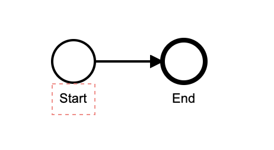

# Zeebe PR Workflow Demo

A demonstration of the Zeebe GitHub Action.

Prerequisites:

* Zeebe Modeler

## Create a GitHub repo

## Create a Zeebe Cluster in Camunda Cloud

## Configure Client Connection Credentials

* Go into your Zeebe cluster in the Camunda Cloud console, and create a new client. You might want to name it "GitHub-Automation" so you know what it is for.
* Copy the "Connection Info" block by clicking the copy icon in the lower right-hand corner.

## Configure Secrets in your GitHub repo

* In your GitHub repo, go to the repository settings Secrets configuration. Add a new Secret named `ZEEBE_CLIENT_CONFIG` and paste the Connection Info in there.

## Create a new model

* Open the Zeebe Modeler, and create a new BPMN Diagram.
* Add an End event.
* Click on the blank area of the canvas to access the properties for the process itself.
* Set the Id to `pr-workflow`.
* Set the Name to `PR Workflow`.

The model should look like this: 



## Create a GitHub workflow to deploy on push

We will create a GitHub workflow to deploy the model on a push to the master branch of the repo.

* Create a folder `.github/workflows` in the root of your repository.
* Create a file in there called `deploy-bpmn-from-master.yml`.
* Paste in the following content: 

```yaml
name: Deploy Workflows

on:
  push:
    branches:
      - master
    paths:
      - 'bpmn/*'

jobs:
  deploy-workflows:
    runs-on: ubuntu-latest

    steps:
      - uses: actions/checkout@v2
      - name: Deploy Updated Workflows
        uses: jwulf/zeebe-action@master
        with:
          clientConfig: ${{ secrets.ZEEBE_CLIENT_CONFIG }}
          operation: deployWorkflow
          bpmnDirectory: bpmn
```
