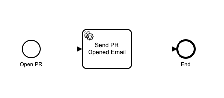
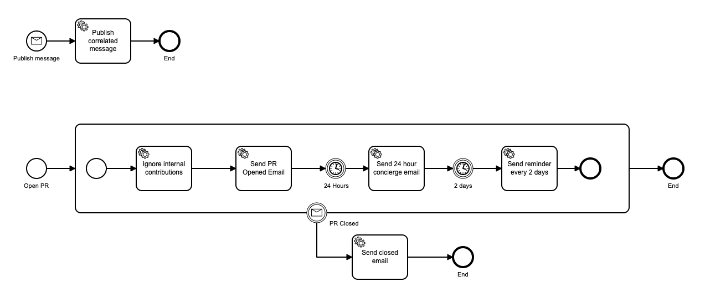

# Zeebe PR Workflow Demo

A demonstration of the Zeebe GitHub Action. In this Getting Started Guide, you will use the Zeebe GitHub Action to automatically deploy BPMN workflows to Camunda Cloud on push to master, and to start a workflow when a new PR is opened and closed.

Our scenario, we have a number of open source repos, and we're going to be encouraging external contributors to submit pull requests.

As part of creating a great contributor experience, we're going to start a workflow when an external contributor opens a pull request. That workflow will enable someone to act as a "concierge" - to keep an eye on it, ensuring that it is getting attention from the project maintainer and that it moves through the process.

We'll use email as our messaging system, and an email inbox as the task list.

## Prerequisites:

* Zeebe Modeler

## Create a GitHub repo

We will use one repository for the automation, including running workers on a schedule. 

Other repositories will have GitHub workflow automation in them to start and update running workflow instances via messages.

## Create a Zeebe Cluster in Camunda Cloud

## Configure Client Connection Credentials

* Go into your Zeebe cluster in the Camunda Cloud console, and create a new client. You might want to name it "GitHub-Automation" so you know what it is for.
* Copy the "Connection Info" block by clicking the copy icon in the lower right-hand corner.

## Configure Secrets in your GitHub repo

* In your GitHub repo, go to the repository settings `Secrets` configuration. 
* Add a new Secret named `ZEEBE_CLIENT_CONFIG` and paste the Connection Info in there.

## Create a new model

* Open the Zeebe Modeler, and create a new BPMN Diagram.
* Add an End event.
* Click on the blank area of the canvas to access the properties for the process itself.
* Set the Id to `pr-workflow`.
* Set the Name to `PR Workflow`.

The model should look like this: 


## Create a GitHub workflow to deploy on push

We will create a GitHub workflow to deploy the model on a push to the master branch of the repo.

* Create a folder `.github/workflows` in the root of your repository.
* Create a file in there called `deploy-bpmn-from-master.yml`.
* Paste in the following content: 

```yaml
name: Deploy Workflows

on:
  push:
    branches:
      - master
    paths:
      - 'bpmn/*'

jobs:
  deploy-workflows:
    runs-on: ubuntu-latest

    steps:
      - uses: actions/checkout@v2
      - name: Deploy Updated Workflows
        uses: jwulf/zeebe-action@master
        with:
          clientConfig: ${{ secrets.ZEEBE_CLIENT_CONFIG }}
          operation: deployWorkflow
          bpmnDirectory: bpmn
```

## Commit and push to master 

* Add the files: 

```bash
git add .
git commit -m "Initial commit"
git push
```

## View Deployed Workflow in Operate

* Go to your cluster overview in Camunda Cloud.
* Click on "View in Operate" at the bottom of the Overview.
* You will see "PR Workflow - 0 Instances in 1 Version" in the "Instances by Workflow" tab.

If you don't see it in there, the deployment may have failed. You can check the GitHub Action execution to see what happened.

## View GitHub Action execution 

* Open your repository on GitHub.
* Click on Actions.
* You will see the run of your workflow in here. 

You can click into it and inspect its execution, and debug any issues.

## Start a Workflow Instance when a Pull Request is opened

* In the `.github/workflows` directory, create the file `open-pr.yml`.
* Paste in the following content: 

```yaml
name: Open PR

on:
  pull_request:
    types: [opened]

jobs:
  open-pr-workflow:
    runs-on: ubuntu-latest

    steps:
      - uses: actions/checkout@v2
      - name: Start Workflow on PR Opened
        uses: jwulf/zeebe-action@master
        with:
          clientConfig: ${{ secrets.ZEEBE_CLIENT_CONFIG }}
          operation: createWorkflowInstance
          bpmnProcessId: pr-workflow
          variables: '{ "pr": ${{ toJson(github.event) }} }'
```
* Commit the new file, and push to master.

## Create a PR

Now we will create a PR to test the workflow creation.

* Create a new branch in your repo:

```bash
git checkout -b pr-1
```

* Create a file in your repo called `README.md`. Put any content you like in it. 

* Add the file, commit, and push to the remote.

```bash
git add .
git commit -m "Add README"
git push --set-upstream origin pr-1
```

## View GitHub Action execution 

* Open your repository on GitHub.
* Click on Actions.
* You will see the run of your workflow in here. 

You can click into it and inspect its execution, and debug any issues.

## View the Workflow Instance in Camunda Cloud

* Go to your cluster in the Camunda Cloud console at [https://camunda.io](https://camunda.io).
* In the overview, click on "View Instances".
* Click on "PR Workflow" in the "Instances by Workflow" column.
* In the Workflows view, click on the Filter checkbox for "Finished Instances".
* Click on the workflow execution in the "Instances panel".

Here you can examine the payload of the workflow, showing you the data received from the PR request.

## Merge Pull Request 

* Merge your pull request on GitHub.
* Switch back to master and pull the merge commit in your local repo:

```bash
git checkout master 
git pull 
```

## Add a Service Task 

* Open the model in the Zeebe Modeler.
* Rename the Start Event to "Open PR". This more accurately represents the semantics of the event.
* Add a Task between the Start and End event.
* Click the spanner/wrench icon on the Task and select "Service Task".
* In the properties panel, set the Name to "Send PR Opened Email".
* Set the Type to `send-email`.
* Click on the `Headers` tab in the properties panel.
* Create a new header with the key `template` and the value `pr_opened`
* Save the model.

The model should look like this: 



## Push Updated BPMN Model

* Push the updated BPMN workflow model to master:

```bash
git add .
git commit -m "update model"
git push
```

## Start a worker 

We will start a Zeebe task worker to service the tasks in the workflow. It will run on a schedule, every hour. 

We will pass the SMTP Configuration to the worker via the environment.

* Create the file `.github/workflows/workers.yml`, and paste the following content:

```yaml
name: Run workers

on:
  schedule:
    - cron: "0 * * * *"

jobs:
  open-pr-workflow:
    runs-on: ubuntu-latest

    steps:
      - uses: actions/checkout@v2
      - name: Start Workers
        uses: jwulf/zeebe-action@master
        env:
          SMTP_USERNAME: ${{ secrets.SMTP_USERNAME }}
          SMTP_PASSWORD: ${{ secrets.SMTP_PASSWORD }}
          SMTP_HOST: ${{ secrets.SMTP_HOST }}
          SMTP_PORT: ${{ secrets.SMTP_PORT }}
          SMTP_FROM: ${{ secrets.SMTP_FROM }}
          SMTP_TO: ${{ secrets.SMTP_TO }}
        with:
          clientConfig: ${{ secrets.ZEEBE_CLIENT_CONFIG }}
          operation: startWorkers
          workerHandlerFile: .github/workflows/workers.js
          workerLifetimeMins: 4
```

## Send an email on PR opening 

We will send an email to a maintainer when a PR is opened. To do this, we will use the [`nodemailer`](https://nodemailer.com/about/) module in the worker.

### SMTP Configuration 

You will need an SMTP server to send email. You can use a service like Amazon's Simple Email Service (SES), Aliyun DirectMail, or (Sendinblue)[https://www.sendinblue.com/].

You will need the following configuration:

* SMTP host name
* SMTP port 
* SMTP user name 
* SMTP password
* SMTP TLS (true/false)
* SMTP from address 
* SMTP to address

Set these as secrets in your GitHub repo with the following keys:

```
SMTP_USERNAME
SMTP_PASSWORD
SMTP_HOST
SMTP_PORT
SMTP_FROM
SMTP_TO
```

### Write the worker code

* In a terminal, change into the GitHub workflow directory:

```bash
cd cd .github/workflows
```

* Initialise an npm project here, and add `nodemailer` and `micromustache` as dependencies:

```bash
npm init -y
npm i nodemailer micromustache
```

* Add `.github/workflows/node_modules` to the `.gitignore` file in the root of your project.

* Create the file `.github/workflows/workers.js`, and paste the following code:

```javascript
const nodemailer = require("nodemailer");
const { render } = require("micromustache");

const host = process.env.SMTP_HOST;
const port = process.env.SMTP_PORT;
const user = process.env.SMTP_USERNAME;
const pass = process.env.SMTP_PASSWORD;
const secure = process.env.SMTP_TLS == "true";
const from = process.env.SMTP_FROM;
const to = process.env.SMTP_TO;

const { mainTemplate } = require("./templates/main");
const { pr_opened } = require("./templates/pr_opened");

const subjects = {
  pr_opened: (event) =>
    `Pull Request ${event.number} opened in ${event.pull_request.base.repo.full_name} by ${event.pull_request.head.user.login}`,
};

const bodyTemplates = {
  pr_opened,
};

module.exports = {
  tasks: {
    "send-email": (job, complete) => {
      const template = job.customHeaders.template;
      const { pr } = job.variables;
      const transporter = nodemailer.createTransport({
        host,
        port,
        secure,
        auth: {
          user,
          pass,
        },
      });

      const body = render(bodyTemplates[template], { pr });
      const html = render(mainTemplate, { body });

      const message = {
        from,
        to,
        subject: subjects[template](pr),
        html,
      };

      const success = (complete) => {
        log.info("Email sent");
        complete.success();
      };

      const failure = (complete, err) => {
        log.info(err);
        complete.failure(err);
      };

      transporter.sendMail(message, (err) =>
        err ? failure(complete, err) : success(complete)
      );
    },
  },
};
```

* Create the file `.github/workflows/templates/main.js`, and paste the following content:

```javascript
module.exports.mainTemplate = `<!doctype html>
<html lang="en">
  <head>
      <meta charset="UTF-8">
      <title>PR</title>
  </head>
  <body>
      {{body}}
  </body>
</html>`;
```

* Create the file `.github/workflows/templates/pr_opened.js`, and paste the following content:

```javascript
module.exports.pr_opened = `<div>
    <p>
        Pull Request {{pr.number}} opened in {{pr.pull_request.base.repo.full_name}} by
        {{pr.pull_request.head.user.login}}
    </p>
    <p>
        View the pull request at <a
          href="{{pr.pull_request._links.html.href}}">
          {{pr.pull_request._links.html.href}}
        </a>.
    </p>
</div>`;
```
* Commit the changes to master.

Now, when you open a PR, you will receive an email notifying you. 

## Further steps 

We're going to modify the workflow like this:



You can download the model from [here]() and open it in the Zeebe modeler.

In this workflow, our concierge receives an email when an external contributor opens a pull request; then an email 24 hours later; then a reminder email every two days until the pull request is closed.

We are going to ignore pull requests from the repo itself - so that it is only run for external contributions.

The boundary interrupting message event cancels the workflow when the PR is closed.

So in the worker for the "Ignore Internal Contributions" task, we will publish this message to cancel the workflow:

* Edit the `.github/workflows/workers.js` file, and modify the `tasks` object to add this worker:

```javascript
// ...
module.exports = {
  tasks: {
    "ignore-internal": (job, complete) => {
      const { pr } = job.variables;

      const isInternalContribution =
        pr.pull_request.base.repo.url === pr.pull_request.head.repo.url;

      const prCorrelationId = pr.pull_request._links.html.href

      return isInternalContribution 
        ?  zbc.publishMessage({
            name: "pr_closed",
            correlationKey: prCorrelationId,
            variables: {},
            ttl: 10,
          }) 
        : complete.success()
    }
  },
  // ...
}
```

* Add `dayjs` to the worker project. Run the following command in the `.github/workflows` directory:

```bash
npm i dayjs
```

* Update the `workers.js` file like this: 

```javascript
const nodemailer = require("nodemailer");
const { render } = require("micromustache");
const relativeTime = require("dayjs/plugin/relativeTime");
const dayjs = require("dayjs");
dayjs.extend(relativeTime);

const host = process.env.SMTP_HOST;
const port = process.env.SMTP_PORT;
const user = process.env.SMTP_USERNAME;
const pass = process.env.SMTP_PASSWORD;
const secure = process.env.SMTP_TLS == "true";
const from = process.env.SMTP_FROM;
const to = process.env.SMTP_TO;

const { mainTemplate } = require("./templates/main");
const { pr_opened } = require("./templates/pr_opened");
const { one_day } = require("./templates/one_day");
const { two_daily } = require("./templates/two_daily");

const subjects = {
  one_day: (pr) =>
    `Pull Request #${pr.number} ${pr.pull_request.base.repo.full_name} by ${pr.pull_request.head.user.login} opened 24 hours ago`,
  two_day: (pr) =>
    `Pull Request #${pr.number} ${pr.pull_request.base.repo.full_name} by ${pr.pull_request.head.user.login} open for ${pr.daysOpen}`,
  pr_opened: (pr) =>
    `Pull Request #${pr.number} opened in ${pr.pull_request.base.repo.full_name} by ${pr.pull_request.head.user.login}`,
};

const bodyTemplates = {
  one_day,
  two_daily,
  pr_opened,
};

module.exports = {
  tasks: {
    "ignore-internal": (job, complete) => {
      const { pr } = job.variables;

      const isInternalContribution =
        pr.pull_request.base.repo.url === pr.pull_request.head.repo.url;

      const prCorrelationId = pr.pull_request._links.html.href;

      return isInternalContribution
        ? zbc.publishMessage({
            name: "pr_closed",
            correlationKey: prCorrelationId,
            variables: {},
            ttl: 10,
          })
        : complete.success();
    },
    "publish-correlated-message": (job, complete) => {
      const { message } = job.variables;
      const correlationKey = message.pr.pull_request._links.html.href;

      zbc
        .publishMessage({
          name: message.messageName,
          correlationKey,
          variables: {
            pr: message.pr,
          },
          ttl: 10,
        })
        .then(() => complete.success())
        .catch(() => complete.failure());
    },
    "send-email": (job, complete) => {
      const template = job.customHeaders.template;
      const { pr } = job.variables;

      pr.daysOpen = dayjs().from(dayjs(pr.pull_request.created_at), true);

      const transporter = nodemailer.createTransport({
        host,
        port,
        secure,
        auth: {
          user,
          pass,
        },
      });

      const body = render(bodyTemplates[template], { event: pr });
      const html = render(mainTemplate, { body });

      const message = {
        from,
        to,
        subject: subjects[template](pr),
        html,
      };

      const success = (complete) => {
        log.info("Email sent");
        complete.success();
      };

      const failure = (complete, err) => {
        log.info(err);
        complete.failure(err);
      };

      transporter.sendMail(message, (err) =>
        err ? failure(complete, err) : success(complete)
      );
    },
  },
};
```

* Add the file `.github/workflows/templates/one_day.js`, with the following :

```javascript
module.exports.one_day = `<div>
    <p>
        24 hours ago, pull Request {{event.number}} opened in {{event.pull_request.base.repo.full_name}} by
        {{event.pull_request.head.user.login}}
    </p>
    <p>
        View the pull request at <a
            href="{{event.pull_request._links.html.href}}">{{event.pull_request._links.html.href}}</a>.
    </p>
</div>`;
```

* Add the file `.github/workflows/templates/two_daily.js`, with the following content: 

```javascript
module.exports.two_daily = `<div>
    <p>
        ${event.daysOpen} ago, pull request {{event.number}} was opened in {{event.pull_request.base.repo.full_name}} by
        {{event.pull_request.head.user.login}}
    </p>
    <p>
        View the pull request at <a
            href="{{event.pull_request._links.html.href}}">{{event.pull_request._links.html.href}}</a>.
    </p>
</div>`;
```

* Create the file `.github/workflows/closed.js`, and paste the following content:

```javascript
module.exports.closed = `<div>
    <p>
        Pull Request #{{event.number}} in {{event.pull_request.base.repo.full_name}} by
        {{event.pull_request.head.user.login}} now closed.
    </p>
    <p>
        View the pull request at <a
            href="{{event.pull_request._links.html.href}}">{{event.pull_request._links.html.href}}</a>.
    </p>
</div>`;
```

* Create the file `.github/workflows/close-pr.yml`, and paste the following content:

```yaml
name: Close PR

on:
  pull_request:
    types: [closed]

jobs:
  open-pr-workflow:
    runs-on: ubuntu-latest

    steps:
      - uses: actions/checkout@v2
      - name: Publish message
        uses: jwulf/zeebe-action@master
        with:
          clientConfig: ${{ secrets.ZEEBE_CLIENT_CONFIG }}
          operation: publishMessage
          messageName: publish-correlated-message
          variables: '{"messageName": "pr_closed", "pr": ${{ toJson(github.event) }}}'
```

This is the GitHub workflow that will run when a PR is closed. It will send a message that will start a new Zeebe workflow. When that workflow is serviced by the batchworker, it will publish a correlation message.

We could publish directly to the running workflow instance, but to do that we would need to extract the correlation key from the `github.event` in the GitHub workflow. Instead, we delegate that to a worker. 

* Push the changes to master.

You now have an automation repo that runs workers every hour to send emails, and to forward messages to running workflows.

## Configure Community repos to participate

In any repository that you want to trigger the automation, add the following files:

* `.github/workflows/open-pr.yml`
* `.github/workflows/close-pr.yml`

And set the following secret in the repository: 

* `ZEEBE_CLIENT_CONFIG`

Now, this repository will trigger the concierge workflow whenever a pull request is opened from a fork.